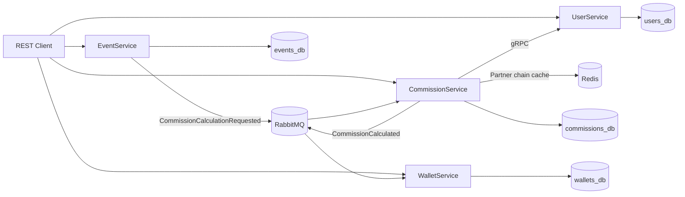
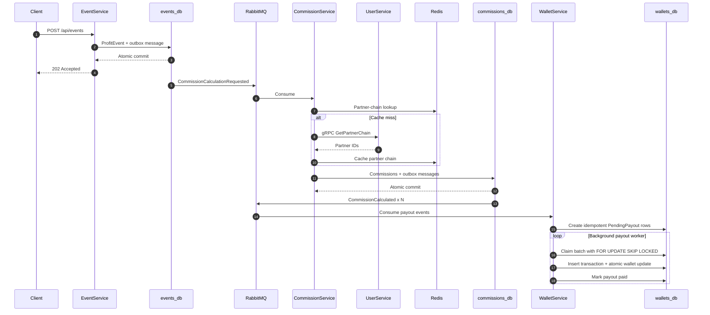

# PartnerSystem

[](https://github.com/alexKuzovkov/PartnerSystem/actions/workflows/ci.yml)


**Distributed .NET 8 backend system for multi-level partner commissions and payouts.**

PartnerSystem is a portfolio-grade microservice project focused on engineering problems that appear in real distributed systems: reliable asynchronous messaging, transactional consistency, idempotency, concurrent background processing, service-to-service communication, caching, database isolation, and full-stack automated testing.

> The project is intentionally built to demonstrate backend engineering decisions rather than only CRUD endpoints.

## What this project demonstrates

- **.NET 8 / ASP.NET Core** microservices with clear service boundaries
- **RabbitMQ + MassTransit** for asynchronous event-driven communication
- **Transactional Outbox** in EventService and CommissionService
- **Database-backed idempotency** across events, commissions, payouts, and wallet credits
- **gRPC** for low-latency synchronous service-to-service communication
- **Redis** caching for partner-chain lookups
- **PostgreSQL `FOR UPDATE SKIP LOCKED`** for horizontally scalable payout workers
- **Atomic wallet updates** designed to avoid lost updates under concurrent deposits
- **Serilog + health checks** for operational visibility
- **Docker Compose** for the complete local environment
- **Unit tests + full PowerShell E2E suite** executed in GitHub Actions

## Architecture at a glance



### Services

| Service | Responsibility |
|---|---|
| **UserService** | User hierarchy, parent relationships, partner-chain traversal, downline projection, gRPC API |
| **EventService** | Accepts profit/loss events, guarantees event idempotency, publishes commission requests through a transactional outbox |
| **CommissionService** | Resolves partner chains, calculates commissions, persists results, publishes payout events through a transactional outbox |
| **WalletService** | Stores pending payouts, claims work across instances, credits wallets atomically, keeps idempotent transaction history |

## End-to-end flow



## Reliability and consistency

### Transactional Outbox

EventService and CommissionService use the **MassTransit Entity Framework Bus Outbox**.

1. Modify domain data in the service `DbContext`.
2. Publish integration events through `IPublishEndpoint`.
3. Call `SaveChangesAsync(...)` once.
4. Domain rows and MassTransit outbox rows are committed atomically.
5. Persisted messages are delivered to RabbitMQ after the database commit.

This prevents the classic distributed-systems failure mode where the database commit succeeds but broker publication fails.

### Idempotency boundaries

| Stage | Idempotency key |
|---|---|
| Profit event | `ProfitEvents.EventExternalId` |
| Commission | `(EventExternalId, PartnerExternalId, Level)` |
| Pending payout | `(CommissionEventExternalId, PartnerExternalId, Level)` |
| Wallet credit | `(UserExternalId, CommissionEventExternalId)` |

### Concurrent payout processing

Workers claim batches through PostgreSQL row-level locking:

```sql
SELECT *
FROM "PendingPayouts"
WHERE NOT "IsPaid"
  AND ("LockedAt" IS NULL OR "LockedAt" < @staleBefore)
ORDER BY "CreatedAt"
FOR UPDATE SKIP LOCKED
LIMIT @batchSize;
```

This allows multiple WalletService instances to process different batches concurrently while avoiding duplicate processing.

## Technology stack

| Area | Technology |
|---|---|
| Runtime | .NET 8, ASP.NET Core |
| ORM | Entity Framework Core 8 |
| Database | PostgreSQL 16 |
| Messaging | RabbitMQ 3.13, MassTransit 8 |
| RPC | gRPC |
| Cache | Redis 7 |
| Logging | Serilog |
| API docs | Swagger / OpenAPI |
| Tests | xUnit, FluentAssertions, PowerShell E2E |
| Containers | Docker, Docker Compose |
| CI | GitHub Actions |

## Quick start

### Full-stack E2E on Windows

```powershell
.\test_all.ps1 -StartServices
```

### Full-stack E2E on Linux / macOS / WSL

```bash
./test_all.sh --start
```

The runner builds and starts PostgreSQL, RabbitMQ, Redis, and all four application services before executing the distributed workflow.

## Testing strategy

### Unit tests

```bash
dotnet test tests/CommissionService.Tests/CommissionService.Tests.csproj
dotnet test tests/WalletService.Tests/WalletService.Tests.csproj
```

### End-to-end coverage

The CI workflow executes the same PowerShell suite used locally:

```powershell
.\test_all.ps1 -StartServices
```

The suite validates:

1. Health checks for all services
2. Partner hierarchy creation
3. Upward chain and downline queries
4. Linear commission calculation
5. Multi-level payouts reaching every partner wallet
6. Fibonacci calculation and historical scheme immutability
7. Duplicate-event idempotency
8. Negative-profit behavior

A successful run currently covers **22 end-to-end assertions** across the complete Docker Compose environment.

## Engineering trade-offs

This repository focuses on distributed backend patterns rather than production platform completeness.

Deliberately out of scope:

- End-user authentication and authorization
- TLS termination and certificate management
- External secret management
- OpenTelemetry collector and external metrics backend
- Kubernetes deployment manifests
- Multi-region database replication

The Docker Compose credentials are local-development defaults only and must not be used in production.
