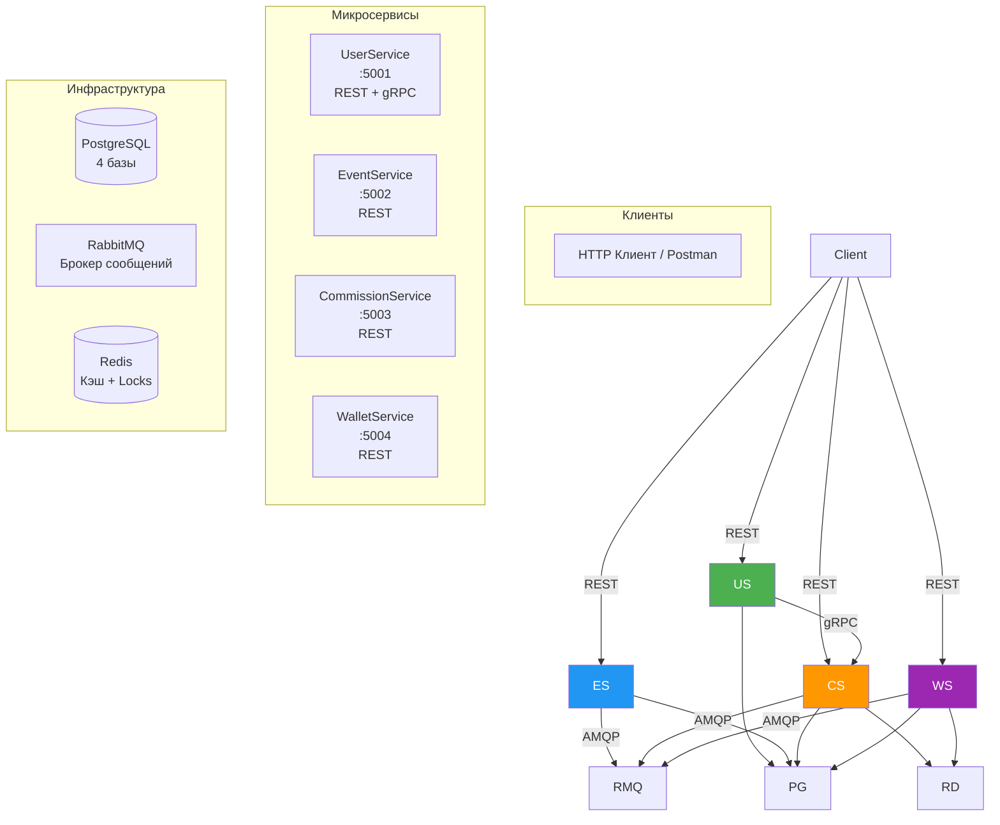

# 🤝 PartnerSystem — Система партнёрских отчислений

Распределённая микросервисная система для начисления и выплаты партнёрских комиссий в иерархии пользователей. Поддерживает две схемы начисления (Linear и Fibonacci), идемпотентность, Outbox-паттерн и горизонтальное масштабирование.

\---

## 📋 Содержание

* [Архитектура](#-архитектура)
* [Технологический стек](#-технологический-стек)
* [Структура проекта](#-структура-проекта)
* [Быстрый старт](#-быстрый-старт)
* [Unit-тесты](#-unit-тесты)
* [Интеграционные тесты](#-интеграционные-тесты)
* [API Reference](#-api-reference)
* [Архитектурные решения](#-архитектурные-решения)

\---

## 🏗 Архитектура

### Общая схема системы



### Поток обработки события


### \### Схема данных

### 

### ```mermaid

### erDiagram

### &#x20;   USERS\_DB ||--o{ USERS\_DB : "parent/child"

### &#x20;   USERS\_DB ||--o{ EVENTS\_DB : "creates events"

### &#x20;   EVENTS\_DB ||--o{ COMMISSIONS\_DB : "generates commissions"

### &#x20;   COMMISSIONS\_DB ||--o{ WALLETS\_DB : "payouts"

### &#x20;   

### &#x20;   USERS\_DB {

### &#x20;       string externalId PK

### &#x20;       string parentId FK

### &#x20;   }

### &#x20;   

### &#x20;   EVENTS\_DB {

### &#x20;       string eventExternalId PK

### &#x20;       string userExternalId FK

### &#x20;       decimal profit

### &#x20;       datetime occurredAt

### &#x20;   }

### &#x20;   

### &#x20;   COMMISSIONS\_DB {

### &#x20;       string id PK

### &#x20;       string eventExternalId FK

### &#x20;       string partnerExternalId

### &#x20;       int level

### &#x20;       decimal amount

### &#x20;       string schemaType

### &#x20;       bool isPaid

### &#x20;   }

### &#x20;   

### &#x20;   WALLETS\_DB {

### &#x20;       string userExternalId PK

### &#x20;       decimal balance

### &#x20;   }```

\---

## 🛠 Технологический стек

|Компонент|Технология|Назначение|
|-|-|-|
|Runtime|.NET 8|Основная платформа|
|БД|PostgreSQL 16|Хранение данных (4 отдельные БД)|
|Брокер|RabbitMQ 3.13|Асинхронная коммуникация|
|Кэш|Redis 7|Кэширование цепочек + distributed locks|
|ORM|Entity Framework Core 8|Работа с БД|
|gRPC|Grpc.AspNetCore|Синхронный вызов UserService → CommissionService|
|Messaging|MassTransit 8|Работа с RabbitMQ + Outbox pattern|
|Логирование|Serilog|Структурированные логи|
|Тесты|xUnit + FluentAssertions|Unit-тесты|
|Контейнеризация|Docker + docker-compose|Локальный запуск|

\---

## 📁 Структура проекта

```
PartnerSystem/
├── src/
│   ├── UserService/              # Управление пользователями и деревом
│   │   ├── Controllers/          # REST API
│   │   ├── Services/             # gRPC PartnerChainService
│   │   ├── Application/          # Бизнес-логика
│   │   ├── Domain/               # Сущности (User)
│   │   └── Infrastructure/       # EF Core, DbContext
│   │
│   ├── EventService/             # Приём и обработка событий
│   │   ├── Controllers/          # REST API
│   │   ├── Application/          # EventProcessor + Outbox
│   │   ├── Domain/               # ProfitEvent
│   │   └── Infrastructure/       # EF Core + MassTransit Outbox
│   │
│   ├── CommissionService/        # Расчёт комиссий
│   │   ├── Controllers/          # REST API (Commissions, Admin)
│   │   ├── Consumers/            # CommissionCalculationConsumer
│   │   ├── Application/          # CommissionCalculator, SchemaSettings
│   │   ├── Domain/               # Commission, SchemaSettings
│   │   └── Infrastructure/       # EF Core
│   │
│   ├── WalletService/            # Кошельки и выплаты
│   │   ├── Controllers/          # REST API
│   │   ├── Consumers/            # CommissionCalculatedConsumer
│   │   ├── Application/          # PayoutBackgroundService
│   │   ├── Domain/               # Wallet, PayoutHistory
│   │   └── Infrastructure/       # EF Core + RedLock
│   │
│   └── Shared/
│       └── PartnerSystem.Contracts/  # Общие контракты (события, gRPC proto)
│
├── tests/
│   └── CommissionService.Tests/  # Unit-тесты на CommissionCalculator
│
├── docker-compose.yml            # Инфраструктура + сервисы
├── test\_all.sh                   # Интеграционные тесты (WSL/Git Bash)
├── test\_all.ps1                  # Интеграционные тесты (PowerShell)
└── README.md
```

\---

## 🚀 Быстрый старт

### Предварительные требования

* **Docker Desktop** (с WSL 2 backend)
* **curl** (для тестов)
* **.NET 8 SDK** (для unit-тестов)

### 1\. Клонирование и подготовка

```bash
cd D:\\Valetax\\PartnerSystem
```

### 2\. Запуск всех сервисов

```bash
docker compose --profile dev up -d --build
```

### 3\. Проверка статуса

```bash
docker compose ps
```

Все сервисы должны иметь статус `Up (healthy)`:

```
NAME                               STATUS
partner\_system\_postgres            Up (healthy)
partner\_system\_rabbitmq            Up (healthy)
partner\_system\_redis               Up (healthy)
partner\_system\_userservice         Up (healthy)
partner\_system\_eventservice        Up (healthy)
partner\_system\_commissionservice   Up (healthy)
partner\_system\_walletservice       Up (healthy)
```

### 4\. Проверка Health Checks

```bash
curl http://localhost:5001/health   # UserService
curl http://localhost:5002/health   # EventService
curl http://localhost:5003/health   # CommissionService
curl http://localhost:5004/health   # WalletService
```

### 5\. Полезные UI

* **RabbitMQ Management**: http://localhost:15672 (guest / guest)
* **Swagger UserService**: http://localhost:5001/swagger
* **Swagger EventService**: http://localhost:5002/swagger
* **Swagger CommissionService**: http://localhost:5003/swagger
* **Swagger WalletService**: http://localhost:5004/swagger

### 6\. Остановка

```bash
docker compose --profile dev down
```

### 7\. Полная очистка (с удалением данных)

```bash
docker compose --profile dev down -v
docker volume rm partner\_system\_postgres\_data partner\_system\_redis\_data partner\_system\_rabbitmq\_data
```

\---

## 🧪 Unit-тесты

Unit-тесты покрывают ключевую бизнес-логику — расчёт комиссий по обеим схемам.

### Запуск (Windows PowerShell)

```powershell
cd D:\\Valetax\\PartnerSystem
dotnet test tests/CommissionService.Tests/ --verbosity normal
```

### Ожидаемый результат

```
Passed!  - Failed:     0, Passed:    10, Skipped:     0, Total:    10
```

### Что тестируется

|Тест|Описание|
|-|-|
|`CalculateCommission\_Linear\_ShouldBeCorrect`|Формула `L × Profit / 100` для уровней 1-10|
|`CalculateCommission\_Fibonacci\_ShouldBeCorrect`|Формула `F(L) × Profit / 100` для уровней 1-10|
|`CalculateCommission\_InvalidInput\_ReturnsZero`|Граничные случаи: profit ≤ 0, level ≤ 0 или > 10|
|`CalculateChainCommissions\_Linear\_ShouldCalculateForAllLevels`|Расчёт для всей цепочки (Linear)|
|`CalculateChainCommissions\_Fibonacci\_ShouldCalculateForAllLevels`|Расчёт для всей цепочки (Fibonacci)|
|`CalculateChainCommissions\_ShouldStoreSchemaType`|Сохранение schema\_type|
|`CalculateChainCommissions\_ShouldRespectMaxLevel`|Ограничение в 10 уровней|
|`CalculateChainCommissions\_ShouldReturnEmptyForZeroProfit`|Пустой результат при profit = 0|
|`CalculateChainCommissions\_ShouldReturnEmptyForNegativeProfit`|Пустой результат при profit < 0|
|`CalculateChainCommissions\_ShouldReturnEmptyForEmptyChain`|Пустой результат при пустой цепочке|

\---

## 🔬 Интеграционные тесты

Скрипт `test\_all.sh` проверяет **все функциональные требования** через реальные HTTP-запросы.

### Запуск (WSL / Git Bash)

```bash
# Сделать исполняемым (один раз)
chmod +x test\_all.sh

# Запустить
./test\_all.sh
```

### Запуск (Windows PowerShell)

```powershell
powershell -ExecutionPolicy Bypass -File .\\test\_all.ps1
```

### Что проверяется

|Блок|Тесты|
|-|-|
|**1. Health Checks**|Все 4 сервиса возвращают `Healthy`|
|**2. Создание иерархии**|`root → u1 → u2 → u3`|
|**3. Ветки дерева**|Вверх (chain) и вниз (downline)|
|**4. Linear схема**|Суммы 10, 20, 30 для уровней 1, 2, 3|
|**5. Fibonacci схема**|Суммы 10, 10, 20 для уровней 1, 2, 3|
|**6. Старые комиссии**|Не пересчитываются при переключении схемы|
|**7. Идемпотентность**|Дубликаты событий не создают дубликаты комиссий|
|**8. Отрицательный Profit**|Комиссии не начисляются|

### Ожидаемый результат

```
========================================
 ИТОГ
========================================
✓ Пройдено: 22
✗ Провалено: 0
========================================
🎉 ВСЕ ТЕСТЫ ПРОЙДЕНЫ! Система готова к сдаче!
```

\---

## 📡 API Reference

### 🟢 UserService (порт 5001)

#### 1\. Создать пользователя

**`POST /api/users`**

```bash
curl -X POST http://localhost:5001/api/users \\
  -H "Content-Type: application/json" \\
  -d '{
    "externalId": "user1",
    "parentExternalId": null
  }'
```

**Ответ 201:**

```json
{
  "externalId": "user1",
  "parentExternalId": null,
  "createdAt": "2026-06-12T12:00:00Z"
}
```

\---

#### 2\. Создать пользователя с партнёром

```bash
curl -X POST http://localhost:5001/api/users \\
  -H "Content-Type: application/json" \\
  -d '{
    "externalId": "user2",
    "parentExternalId": "user1"
  }'
```

\---

#### 3\. Получить ветку ВВЕРХ (цепочка партнёров)

**`GET /api/users/{externalId}/chain`**

```bash
curl -s http://localhost:5001/api/users/user3/chain
```

**Ответ 200:**

```json
\[
  {"externalId": "user2", "level": 1},
  {"externalId": "user1", "level": 2},
  {"externalId": "root",  "level": 3}
]
```

\---

#### 4\. Получить ветку ВНИЗ (все потомки)

**`GET /api/users/{externalId}/downline`**

```bash
curl -s http://localhost:5001/api/users/root/downline
```

**Ответ 200:**

```json
\[
  {"userExternalId": "user1", "level": 1, "directReferralsCount": 1},
  {"userExternalId": "user2", "level": 2, "directReferralsCount": 1},
  {"userExternalId": "user3", "level": 3, "directReferralsCount": 1}
]
```

\---

### 🔵 EventService (порт 5002)

#### 5\. Отправить событие о прибыли

**`POST /api/events`**

```bash
curl -X POST http://localhost:5002/api/events \\
  -H "Content-Type: application/json" \\
  -d '{
    "eventExternalId": "evt001",
    "userExternalId": "user3",
    "profit": 1000
  }'
```

**Ответ 200:**

```json
{"message": "Event accepted"}
```

> 💡 Событие асинхронно обработается: EventService сохранит его в БД и через Outbox опубликует в RabbitMQ. CommissionService рассчитает комиссии.

\---

#### 6\. Отправить событие об убытке

```bash
curl -X POST http://localhost:5002/api/events \\
  -H "Content-Type: application/json" \\
  -d '{
    "eventExternalId": "evt\_loss",
    "userExternalId": "user3",
    "profit": -500
  }'
```

> 💡 Комиссии \*\*не будут\*\* начислены (profit ≤ 0).

\---

#### 7\. Получить список событий пользователя

**`GET /api/events?userExternalId={id}`**

```bash
curl -s "http://localhost:5002/api/events?userExternalId=user3"
```

**Ответ 200:**

```json
\[
  {
    "externalId": "evt001",
    "userExternalId": "user3",
    "profit": 1000,
    "occurredAt": "2026-06-12T12:05:00Z",
    "status": "Processed"
  }
]
```

\---

### 🟠 CommissionService (порт 5003)

#### 8\. Получить детали комиссий по событию

**`GET /api/commissions/{eventExternalId}`**

```bash
curl -s http://localhost:5003/api/commissions/evt001
```

**Ответ 200 (Linear схема):**

```json
{
  "eventExternalId": "evt001",
  "commissions": \[
    {
      "partnerExternalId": "user2",
      "level": 1,
      "amount": 10.00,
      "schemaType": "Linear",
      "isPaid": false
    },
    {
      "partnerExternalId": "user1",
      "level": 2,
      "amount": 20.00,
      "schemaType": "Linear",
      "isPaid": false
    },
    {
      "partnerExternalId": "root",
      "level": 3,
      "amount": 30.00,
      "schemaType": "Linear",
      "isPaid": false
    }
  ]
}
```

\---

#### 9\. Получить текущую схему начисления

**`GET /api/admin/schema`**

```bash
curl -s http://localhost:5003/api/admin/schema
```

**Ответ 200:**

```json
{"schema": "Linear"}
```

\---

#### 10\. Переключить схему на Fibonacci

**`POST /api/admin/schema`**

```bash
curl -X POST http://localhost:5003/api/admin/schema \\
  -H "Content-Type: application/json" \\
  -d '{"schema": "Fibonacci"}'
```

**Ответ 200:**

```json
{"message": "Схема успешно переключена", "schema": "Fibonacci"}
```

> 💡 Переключение влияет только на \*\*новые\*\* расчёты. Старые комиссии сохраняют свой `schemaType`.

\---

#### 11\. Переключить схему обратно на Linear

```bash
curl -X POST http://localhost:5003/api/admin/schema \\
  -H "Content-Type: application/json" \\
  -d '{"schema": "Linear"}'
```

\---

### 🟣 WalletService (порт 5004)

#### 12\. Получить баланс пользователя

**`GET /api/wallets/{userExternalId}/balance`**

```bash
curl -s http://localhost:5004/api/wallets/user1/balance
```

**Ответ 200:**

```json
{
  "userExternalId": "user1",
  "balance": 20.00
}
```

> 💡 Баланс обновляется фоновым сервисом каждые 5 минут.

\---

#### 13\. Получить историю выплат

**`GET /api/wallets/{userExternalId}/history`**

```bash
curl -s http://localhost:5004/api/wallets/user1/history
```

**Ответ 200:**

```json
\[
  {
    "commissionEventExternalId": "evt001",
    "amount": 20.00,
    "level": 2,
    "paidAt": "2026-06-12T12:10:00Z"
  }
]
```

\---

## 🎓 Пошаговый сценарий проверки

### Сценарий 1: Полный цикл начисления комиссий (Linear)

```bash
# 1. Устанавливаем Linear схему
curl -X POST http://localhost:5003/api/admin/schema \\
  -H "Content-Type: application/json" \\
  -d '{"schema": "Linear"}'

# 2. Создаём иерархию: root → alice → bob → charlie
curl -X POST http://localhost:5001/api/users -H "Content-Type: application/json" -d '{"externalId":"root"}'
curl -X POST http://localhost:5001/api/users -H "Content-Type: application/json" -d '{"externalId":"alice","parentExternalId":"root"}'
curl -X POST http://localhost:5001/api/users -H "Content-Type: application/json" -d '{"externalId":"bob","parentExternalId":"alice"}'
curl -X POST http://localhost:5001/api/users -H "Content-Type: application/json" -d '{"externalId":"charlie","parentExternalId":"bob"}'

# 3. charlie зарабатает 1000
curl -X POST http://localhost:5002/api/events -H "Content-Type: application/json" \\
  -d '{"eventExternalId":"s1\_evt","userExternalId":"charlie","profit":1000}'

# 4. Ждём 15 секунд (обработка + публикация + расчёт)
sleep 15

# 5. Проверяем комиссии (должны быть 10, 20, 30)
curl -s http://localhost:5003/api/commissions/s1\_evt | grep -o '"amount":\[0-9.]\*'
```

**Ожидаемые суммы (Linear: L × 1000 / 100):**

* bob (L1): 1 × 10 = **10**
* alice (L2): 2 × 10 = **20**
* root (L3): 3 × 10 = **30**

\---

### Сценарий 2: Переключение на Fibonacci

```bash
# 1. Переключаем на Fibonacci
curl -X POST http://localhost:5003/api/admin/schema \\
  -H "Content-Type: application/json" \\
  -d '{"schema": "Fibonacci"}'

# 2. Новое событие от charlie
curl -X POST http://localhost:5002/api/events -H "Content-Type: application/json" \\
  -d '{"eventExternalId":"s2\_evt","userExternalId":"charlie","profit":1000}'

sleep 15

# 3. Проверяем (должны быть 10, 10, 20)
curl -s http://localhost:5003/api/commissions/s2\_evt | grep -o '"amount":\[0-9.]\*'
```

**Ожидаемые суммы (Fibonacci: F(L) × 1000 / 100):**

* bob (L1): F(1)=1 × 10 = **10**
* alice (L2): F(2)=1 × 10 = **10**
* root (L3): F(3)=2 × 10 = **20**

\---

### Сценарий 3: Проверка, что старые комиссии не пересчитываются

```bash
# Событие s1\_evt было рассчитано по Linear — должно остаться Linear
curl -s http://localhost:5003/api/commissions/s1\_evt | grep -o '"schemaType":"\[A-Za-z]\*"'
```

**Ожидаемо:** `"schemaType":"Linear"` (не изменилось!)

\---

### Сценарий 4: Идемпотентность

```bash
# Отправляем одно и то же событие 5 раз
for i in 1 2 3 4 5; do
  curl -s -X POST http://localhost:5002/api/events \\
    -H "Content-Type: application/json" \\
    -d '{"eventExternalId":"idempotent","userExternalId":"charlie","profit":100}'
done

sleep 10

# Проверяем — должно быть ровно 3 комиссии (по одной на каждого партнёра)
curl -s http://localhost:5003/api/commissions/idempotent | grep -o '"partnerExternalId"' | wc -l
```

**Ожидаемо:** `3`

\---

### Сценарий 5: Отрицательный profit

```bash
# charlie теряет 500
curl -X POST http://localhost:5002/api/events -H "Content-Type: application/json" \\
  -d '{"eventExternalId":"loss\_evt","userExternalId":"charlie","profit":-500}'

sleep 10

# Комиссий быть не должно
curl -s http://localhost:5003/api/commissions/loss\_evt
```

**Ожидаемо:** `{"eventExternalId":"loss\_evt","commissions":\[]}`

\---

## 🏛 Архитектурные решения

### 1\. Границы микросервисов

|Сервис|Ответственность|Владеет данными|
|-|-|-|
|**UserService**|Пользователи, иерархия, gRPC API для получения цепочки|`users\_db.Users`|
|**EventService**|Приём событий, идемпотентность, Outbox|`events\_db.ProfitEvents`, `OutboxMessages`|
|**CommissionService**|Расчёт комиссий, администрирование схемы|`commissions\_db.Commissions`, `SchemaSettings`|
|**WalletService**|Кошельки, периодические выплаты|`wallets\_db.Wallets`, `PayoutHistory`|

**Почему так:**

* Каждый сервис владеет своей БД (принцип Database-per-Service)
* Чёткое разделение ответственности (Single Responsibility)
* Независимое масштабирование каждого сервиса

### 2\. Выбор протоколов

|Связь|Протокол|Обоснование|
|-|-|-|
|Клиент → Сервисы|REST/HTTP|Универсальность, простота|
|CommissionService → UserService|**gRPC**|Синхронный вызов, низкая задержка, строгая типизация|
|EventService → CommissionService|**RabbitMQ (async)**|Асинхронность, отказоустойчивость|
|CommissionService → WalletService|**RabbitMQ (async)**|Развязка сервисов|

### 3\. Outbox Pattern

**Проблема:** Если сначала опубликовать в RabbitMQ, а потом сохранить в БД — при сбое БД сообщение уйдёт, но данных не будет. Если наоборот — данные сохранятся, но сообщение может не уйти.

**Решение:** Сохраняем событие и сообщение в Outbox **в одной транзакции**:

```csharp
await \_context.ProfitEvents.AddAsync(profitEvent);
await \_publishEndpoint.Publish(calculationEvent);  // MassTransit добавит в OutboxMessages
await \_context.SaveChangesAsync();  // Одна транзакция!
```

Фоновый `OutboxProcessor` читает необработанные сообщения и публикует их в RabbitMQ.

### 4\. Идемпотентность

Реализована на **трёх уровнях**:

1. **События:** уникальный индекс на `ProfitEvents.EventExternalId`
2. **Комиссии:** составной уникальный индекс `(EventExternalId, PartnerExternalId, Level)`
3. **Выплаты:** уникальный индекс на `PayoutHistory.CommissionEventExternalId` + distributed lock

### 5\. Переключение схемы

* Хранится в таблице `SchemaSettings` (одна запись на всю систему)
* Каждая комиссия хранит свой `schemaType` — старые не пересчитываются
* `CommissionCalculationConsumer` читает схему **в момент обработки** события

### 6\. Горизонтальная масштабируемость

* Все сервисы **stateless** (состояние в БД/Redis)
* RabbitMQ распределяет сообщения между инстансами
* `PayoutBackgroundService` использует **distributed lock** (RedLock) — только один инстанс выполняет выплаты в каждый момент

### 7\. Отказоустойчивость

|Механизм|Где используется|
|-|-|
|**Retry**|MassTransit (3 попытки с интервалом 5 сек)|
|**Circuit Breaker**|EventService (gRPC вызовы)|
|**Graceful Shutdown**|Все сервисы (`IHostApplicationLifetime`)|
|**Health Checks**|Все сервисы (`/health`)|
|**Outbox**|Гарантированная доставка сообщений|

### 8\. Кэширование

* **Redis** кэширует цепочки партнёров (TTL 15 минут)
* Снижает нагрузку на UserService при частых расчётах
* При недоступности Redis — fallback на gRPC

### 9\. Логирование

* **Serilog** со структурированными логами
* Корреляция по `EventExternalId` (видно всю цепочку обработки)
* Уровни: `Information` (успех), `Warning` (идемпотентность), `Error` (сбои)

\---

## 📝 Лицензия

Учебный проект.

\---

## 👨‍💻 Автор

Разработано в рамках тестового задания.

