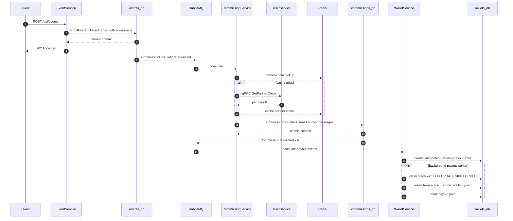

# PartnerSystem

A distributed .NET 8 backend that models a multi-level partner commission and payout workflow.

The project is intentionally designed as a backend engineering portfolio example: it demonstrates service boundaries, asynchronous messaging, transactional outbox, idempotency, PostgreSQL concurrency control, gRPC, Redis caching, background processing, health checks, Docker-based local infrastructure, and automated tests.

## Highlights

- **.NET 8 / ASP.NET Core** microservices
- **PostgreSQL 16** with a separate database per service
- **RabbitMQ + MassTransit** for asynchronous integration
- **MassTransit EF Bus Outbox** in EventService and CommissionService
- **gRPC** for low-latency CommissionService → UserService calls
- **Redis** cache for partner-chain lookups
- **Database-backed idempotency** at every important write boundary
- **`FOR UPDATE SKIP LOCKED`** for horizontally scalable payout workers
- **Atomic PostgreSQL wallet upsert** to avoid lost updates under concurrent deposits
- **Serilog** structured logging and health checks
- **Docker Compose** for the complete local environment
- **xUnit + FluentAssertions** unit tests
- **Bash and PowerShell** end-to-end test runners
- **GitHub Actions** build and test workflow

## Architecture


### Service responsibilities

| Service | Responsibility |
|---|---|
| **UserService** | User hierarchy, parent relationships, upward partner chain, downline projection, gRPC API |
| **EventService** | Accepts profit/loss events, guarantees event idempotency, publishes commission requests through a transactional outbox |
| **CommissionService** | Reads the active calculation scheme, resolves partner chains, calculates commissions, persists results, publishes payout events through a transactional outbox |
| **WalletService** | Stores pending payouts, claims work across multiple instances, credits wallets atomically, keeps idempotent transaction history |

## Event flow



## Reliability and consistency

### Transactional outbox

EventService and CommissionService use **MassTransit Entity Framework Bus Outbox**.

The important ordering is deliberate:

1. Modify domain data in the service `DbContext`.
2. Call `IPublishEndpoint.Publish(...)`.
3. Call `SaveChangesAsync(...)` once.
4. EF commits domain rows and MassTransit outbox rows atomically.
5. MassTransit delivers the persisted messages to RabbitMQ after the database commit.

This prevents the classic failure mode where the database commit succeeds but the broker publish fails.

### Idempotency boundaries

The database is treated as the final source of truth for duplicate protection.

| Stage | Idempotency key |
|---|---|
| Profit event | `ProfitEvents.EventExternalId` |
| Commission | `(EventExternalId, PartnerExternalId, Level)` |
| Pending payout | `(CommissionEventExternalId, PartnerExternalId, Level)` |
| Wallet credit | `(UserExternalId, CommissionEventExternalId)` in `Transactions` |

The pending-payout composite key is important because one source event can generate several partner commissions. Using only the event id would incorrectly allow just one payout per event.

### Concurrent payout processing

Payout workers do **not** use a global advisory lock.

Each worker claims a small batch using PostgreSQL:

```sql
SELECT *
FROM "PendingPayouts"
WHERE NOT "IsPaid"
  AND ("LockedAt" IS NULL OR "LockedAt" < @staleBefore)
ORDER BY "CreatedAt"
FOR UPDATE SKIP LOCKED
LIMIT @batchSize;
```

The selected rows are marked with an instance id and claim timestamp in a short transaction. Other service instances skip rows locked by the current transaction and can claim different work immediately.

If an instance dies after claiming a row, the claim becomes eligible again after the configured timeout.

### Concurrent wallet credits

Wallet credits use two PostgreSQL operations in one transaction:

1. Insert the transaction row with `ON CONFLICT DO NOTHING` as the idempotency gate.
2. Upsert the wallet and increment the balance atomically.

This avoids both duplicate credits and lost updates when several workers deposit into the same wallet concurrently.

## Commission schemes

Two calculation modes are supported.

### Linear

For hierarchy level `L` and profit `P`:

```text
commission = L * P / 100
```

For `P = 1000`:

| Level | Commission |
|---:|---:|
| 1 | 10 |
| 2 | 20 |
| 3 | 30 |

### Fibonacci

```text
commission = Fibonacci(L) * P / 100
```

For `P = 1000`:

| Level | Fibonacci | Commission |
|---:|---:|---:|
| 1 | 1 | 10 |
| 2 | 1 | 10 |
| 3 | 2 | 20 |
| 4 | 3 | 30 |
| 5 | 5 | 50 |

The active scheme is stored in `SchemaSettings`. Each persisted commission stores the scheme used for its calculation, so changing the setting does not rewrite historical results.

## Technology stack

| Area | Technology |
|---|---|
| Runtime | .NET 8, ASP.NET Core |
| ORM | Entity Framework Core 8 |
| Database | PostgreSQL 16 |
| Messaging | RabbitMQ 3.13, MassTransit 8 |
| Service-to-service RPC | gRPC |
| Cache | Redis 7 |
| Logging | Serilog |
| API documentation | Swagger / OpenAPI |
| Tests | xUnit, FluentAssertions |
| Containers | Docker, Docker Compose |
| CI | GitHub Actions |

## Repository layout

```text
PartnerSystem/
├── .github/
│   └── workflows/
│       └── ci.yml
├── .editorconfig
├── .env.example
├── src/
│   ├── UserService/
│   ├── EventService/
│   ├── CommissionService/
│   ├── WalletService/
│   └── Shared/
│       └── PartnerSystem.Contracts/
├── tests/
│   ├── CommissionService.Tests/
│   └── WalletService.Tests/
├── Directory.Build.props
├── Directory.Packages.props
├── PartnerSystem.slnx
├── docker-compose.yml
├── init-db.sh
├── test_all.sh
├── test_all.ps1
└── README.md
```

## Quick start

### Prerequisites

- Docker Desktop or Docker Engine with Compose v2
- Optional: .NET 8 SDK for running unit tests outside containers
- Optional: PowerShell 5.1+ or PowerShell 7 for the Windows end-to-end runner

### Start the full environment

The Compose file has development defaults. To override local credentials, copy the example environment file and edit it:

```bash
cp .env.example .env
```

Then start the stack:

```bash
docker compose up -d --build
```

Check container status:

```bash
docker compose ps
```

The PostgreSQL initialization script creates four databases automatically:

- `users_db`
- `events_db`
- `commissions_db`
- `wallets_db`

If you previously ran an older schema version of this project, reset local volumes before the first run of the refactored version:

```bash
docker compose down -v
docker compose up -d --build
```

### Service endpoints

| Service | URL |
|---|---|
| UserService REST | `http://localhost:5001` |
| EventService | `http://localhost:5002` |
| CommissionService | `http://localhost:5003` |
| WalletService | `http://localhost:5004` |
| RabbitMQ Management | `http://localhost:15672` |

UserService exposes gRPC internally on port `8080` and REST/health checks on port `8081` inside its container.

## API examples

### Create a hierarchy

```bash
curl -X POST http://localhost:5001/api/users \
  -H "Content-Type: application/json" \
  -d '{"externalId":"root"}'

curl -X POST http://localhost:5001/api/users \
  -H "Content-Type: application/json" \
  -d '{"externalId":"alice","parentExternalId":"root"}'

curl -X POST http://localhost:5001/api/users \
  -H "Content-Type: application/json" \
  -d '{"externalId":"bob","parentExternalId":"alice"}'

curl -X POST http://localhost:5001/api/users \
  -H "Content-Type: application/json" \
  -d '{"externalId":"charlie","parentExternalId":"bob"}'
```

Get the upward partner chain:

```bash
curl http://localhost:5001/api/users/charlie/chain
```

Get the downline:

```bash
curl http://localhost:5001/api/users/root/downline
```

### Select the calculation scheme

```bash
curl -X POST http://localhost:5003/api/admin/schema \
  -H "Content-Type: application/json" \
  -d '{"schema":"Linear"}'
```

or:

```bash
curl -X POST http://localhost:5003/api/admin/schema \
  -H "Content-Type: application/json" \
  -d '{"schema":"Fibonacci"}'
```

### Submit a profit event

```bash
curl -X POST http://localhost:5002/api/events \
  -H "Content-Type: application/json" \
  -d '{
    "eventExternalId":"evt-001",
    "userExternalId":"charlie",
    "profit":1000,
    "occurredAt":"2026-08-15T10:00:00Z"
  }'
```

### Read calculated commissions

```bash
curl http://localhost:5003/api/commissions/evt-001
```

### Read wallet state

```bash
curl http://localhost:5004/api/wallets/alice/balance
curl http://localhost:5004/api/wallets/alice/transactions
```

## Testing

### Unit tests

Run all unit test projects:

```bash
dotnet test tests/CommissionService.Tests/CommissionService.Tests.csproj
dotnet test tests/WalletService.Tests/WalletService.Tests.csproj
```

The tests cover commission formulas, boundary conditions, domain invariants, wallet balance rules, and payout claim state transitions.

### End-to-end tests on Linux / macOS / WSL

If the services are already running:

```bash
./test_all.sh
```

Build and start the stack automatically before testing:

```bash
./test_all.sh --start
```

### End-to-end tests on Windows PowerShell

If the services are already running:

```powershell
.\test_all.ps1
```

Build and start the stack automatically:

```powershell
.\test_all.ps1 -StartServices
```

The GitHub Actions workflow runs the PowerShell end-to-end suite against the full Docker Compose stack after the build and unit-test job succeeds.

The end-to-end suite validates:

1. Service health checks
2. User hierarchy creation
3. Upward chain and downline queries
4. Linear commission calculation
5. Multi-level payouts reaching **every** partner wallet
6. Fibonacci calculation and historical scheme immutability
7. Duplicate-event idempotency
8. Negative-profit behavior

## Development checks

Validate Docker Compose configuration:

```bash
docker compose config --quiet
```

Inspect logs:

```bash
docker compose logs --tail=200
```

Stop services:

```bash
docker compose down
```

Stop services and remove local data:

```bash
docker compose down -v
```

## Engineering trade-offs

This repository focuses on distributed backend patterns rather than production platform completeness.

Deliberately out of scope for the demo:

- End-user authentication and authorization
- TLS termination and certificate management
- Secret management through Vault / cloud secret stores
- OpenTelemetry collector and external metrics backend
- Kubernetes deployment manifests
- Multi-region database replication

The Docker Compose credentials are local-development defaults only and must not be used in a real environment.

## Suggested GitHub topics

`dotnet` · `csharp` · `aspnet-core` · `microservices` · `distributed-systems` · `rabbitmq` · `masstransit` · `postgresql` · `redis` · `grpc` · `transactional-outbox` · `idempotency` · `docker`
