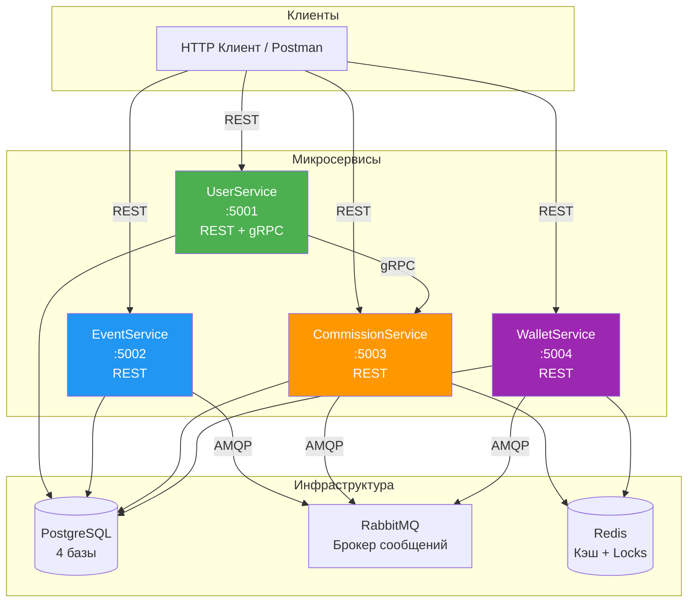
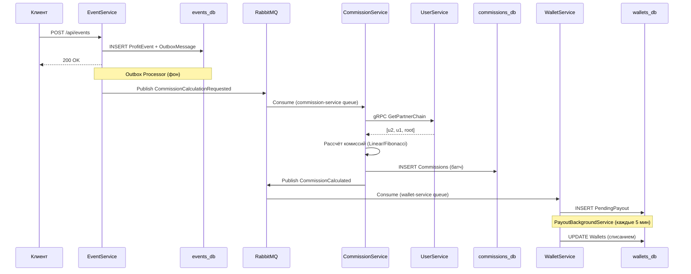
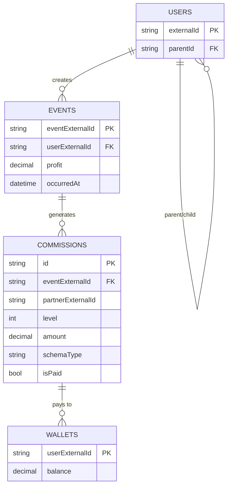

# 🤝 PartnerSystem — Система партнёрских отчислений

Распределённая микросервисная система для начисления и выплаты партнёрских комиссий в иерархии пользователей. Поддерживает две схемы начисления (Linear и Fibonacci), идемпотентность, Outbox-паттерн и горизонтальное масштабирование.

---

## 📋 Содержание

- [Архитектура](#-архитектура)
- [Технологический стек](#-технологический-стек)
- [Структура проекта](#-структура-проекта)
- [Быстрый старт](#-быстрый-старт)
- [Unit-тесты](#-unit-тесты)
- [Интеграционные тесты](#-интеграционные-тесты)
- [API Reference](#-api-reference)
- [Архитектурные решения](#-архитектурные-решения)

---

## 🏗 Архитектура

### Общая схема системы



### Поток обработки события



### Схема данных



---

## 🛠 Технологический стек

| Компонент | Технология | Назначение |
|-----------|------------|------------|
| Runtime | .NET 8 | Основная платформа |
| БД | PostgreSQL 16 | Хранение данных (4 отдельные БД) |
| Брокер | RabbitMQ 3.13 | Асинхронная коммуникация |
| Кэш | Redis 7 | Кэширование цепочек + distributed locks |
| ORM | Entity Framework Core 8 | Работа с БД |
| gRPC | Grpc.AspNetCore | Синхронный вызов UserService → CommissionService |
| Messaging | MassTransit 8 | Работа с RabbitMQ + Outbox pattern |
| Логирование | Serilog | Структурированные логи |
| Тесты | xUnit + FluentAssertions | Unit-тесты |
| Контейнеризация | Docker + docker-compose | Локальный запуск |

---

## 📁 Структура проекта

```
PartnerSystem/
├── src/
│   ├── UserService/              # Управление пользователями и деревом
│   ├── EventService/             # Приём и обработка событий
│   ├── CommissionService/        # Расчёт комиссий
│   ├── WalletService/            # Кошельки и выплаты
│   └── Shared/
│       └── PartnerSystem.Contracts/
│
├── tests/
│   └── CommissionService.Tests/
│
├── docker-compose.yml
├── test_all.sh
└── README.md
```

---

## 🚀 Быстрый старт

### Предварительные требования

- **Docker Desktop** (с WSL 2 backend)
- **curl** (для тестов)
- **.NET 8 SDK** (для unit-тестов)

### 1. Запуск всех сервисов

```bash
cd D:\Valetax\PartnerSystem
docker compose --profile dev up -d --build
```

### 2. Проверка статуса

```bash
docker compose ps
```

Все сервисы должны иметь статус `Up (healthy)`.

### 3. Проверка Health Checks

```bash
curl http://localhost:5001/health
curl http://localhost:5002/health
curl http://localhost:5003/health
curl http://localhost:5004/health
```

### 4. Полезные UI

- **RabbitMQ Management**: http://localhost:15672 (guest / guest)
- **Swagger UserService**: http://localhost:5001/swagger
- **Swagger EventService**: http://localhost:5002/swagger
- **Swagger CommissionService**: http://localhost:5003/swagger
- **Swagger WalletService**: http://localhost:5004/swagger

### 5. Остановка и очистка

```bash
docker compose --profile dev down
docker compose --profile dev down -v
```

---

## 🧪 Unit-тесты

```powershell
cd D:\Valetax\PartnerSystem
dotnet test tests/CommissionService.Tests/ --verbosity normal
```

Ожидаемый результат: `Passed: 10, Failed: 0`

---

## 🔬 Интеграционные тесты

```bash
chmod +x test_all.sh
./test_all.sh
```

---

## 📡 API Reference

### 🟢 UserService (порт 5001)

**Создать пользователя:**

```bash
curl -X POST http://localhost:5001/api/users -H "Content-Type: application/json" -d '{"externalId":"user1","parentExternalId":null}'
```

**Получить ветку вверх (цепочка партнёров):**

```bash
curl -s http://localhost:5001/api/users/user3/chain
```

**Получить ветку вниз (все потомки):**

```bash
curl -s http://localhost:5001/api/users/root/downline
```

### 🔵 EventService (порт 5002)

**Отправить событие о прибыли:**

```bash
curl -X POST http://localhost:5002/api/events -H "Content-Type: application/json" -d '{"eventExternalId":"evt001","userExternalId":"user3","profit":1000}'
```

### 🟠 CommissionService (порт 5003)

**Получить детали комиссий:**

```bash
curl -s http://localhost:5003/api/commissions/evt001
```

**Получить текущую схему:**

```bash
curl -s http://localhost:5003/api/admin/schema
```

**Переключить схему на Fibonacci:**

```bash
curl -X POST http://localhost:5003/api/admin/schema -H "Content-Type: application/json" -d '{"schema":"Fibonacci"}'
```

### 🟣 WalletService (порт 5004)

**Получить баланс:**

```bash
curl -s http://localhost:5004/api/wallets/user1/balance
```

**История выплат:**

```bash
curl -s http://localhost:5004/api/wallets/user1/history
```

---

## 🎓 Пошаговый сценарий проверки

### Сценарий 1: Полный цикл (Linear)

```bash
# 1. Устанавливаем Linear схему
curl -X POST http://localhost:5003/api/admin/schema -H "Content-Type: application/json" -d '{"schema":"Linear"}'

# 2. Создаём иерархию
curl -X POST http://localhost:5001/api/users -H "Content-Type: application/json" -d '{"externalId":"root"}'
curl -X POST http://localhost:5001/api/users -H "Content-Type: application/json" -d '{"externalId":"alice","parentExternalId":"root"}'
curl -X POST http://localhost:5001/api/users -H "Content-Type: application/json" -d '{"externalId":"bob","parentExternalId":"alice"}'
curl -X POST http://localhost:5001/api/users -H "Content-Type: application/json" -d '{"externalId":"charlie","parentExternalId":"bob"}'

# 3. charlie зарабатывает 1000
curl -X POST http://localhost:5002/api/events -H "Content-Type: application/json" -d '{"eventExternalId":"s1_evt","userExternalId":"charlie","profit":1000}'

# 4. Ждём 15 секунд
sleep 15

# 5. Проверяем комиссии
curl -s http://localhost:5003/api/commissions/s1_evt
```

### Сценарий 2: Переключение на Fibonacci

```bash
curl -X POST http://localhost:5003/api/admin/schema -H "Content-Type: application/json" -d '{"schema":"Fibonacci"}'
curl -X POST http://localhost:5002/api/events -H "Content-Type: application/json" -d '{"eventExternalId":"s2_evt","userExternalId":"charlie","profit":1000}'
sleep 15
curl -s http://localhost:5003/api/commissions/s2_evt
```

### Сценарий 3: Идемпотентность

```bash
for i in 1 2 3 4 5; do
  curl -s -X POST http://localhost:5002/api/events -H "Content-Type: application/json" -d '{"eventExternalId":"idempotent","userExternalId":"charlie","profit":100}'
done
sleep 10
curl -s http://localhost:5003/api/commissions/idempotent
```

### Сценарий 4: Отрицательный profit

```bash
curl -X POST http://localhost:5002/api/events -H "Content-Type: application/json" -d '{"eventExternalId":"loss_evt","userExternalId":"charlie","profit":-500}'
sleep 10
curl -s http://localhost:5003/api/commissions/loss_evt
```

---

## 🏛 Архитектурные решения

### 1. Границы микросервисов

| Сервис | Ответственность |
|--------|-----------------|
| **UserService** | Пользователи, иерархия, gRPC API |
| **EventService** | Приём событий, Outbox pattern |
| **CommissionService** | Расчёт комиссий, администрирование схемы |
| **WalletService** | Кошельки, периодические выплаты |

### 2. Выбор протоколов

| Связь | Протокол | Обоснование |
|-------|----------|-------------|
| Клиент → Сервисы | REST/HTTP | Универсальность |
| CommissionService → UserService | **gRPC** | Низкая задержка |
| EventService → CommissionService | **RabbitMQ** | Асинхронность |
| CommissionService → WalletService | **RabbitMQ** | Развязка сервисов |

### 3. Outbox Pattern

Сохраняем событие и сообщение в Outbox **в одной транзакции** — это гарантирует, что либо запишется всё, либо ничего.

### 4. Идемпотентность

Реализована на трёх уровнях:
1. Уникальный индекс на `ProfitEvents.EventExternalId`
2. Составной индекс на `(EventExternalId, PartnerExternalId, Level)`
3. Уникальный индекс на `PayoutHistory.CommissionEventExternalId`

### 5. Переключение схемы

Хранится в таблице `SchemaSettings`. Каждая комиссия хранит свой `schemaType` — старые не пересчитываются при переключении.

### 6. Отказоустойчивость

- **Retry** в MassTransit (3 попытки)
- **Circuit Breaker** для gRPC вызовов
- **Health Checks** для всех сервисов
- **Distributed Lock** (RedLock) для выплат

---

## 👨‍💻 Автор

Разработано в рамках тестового задания.